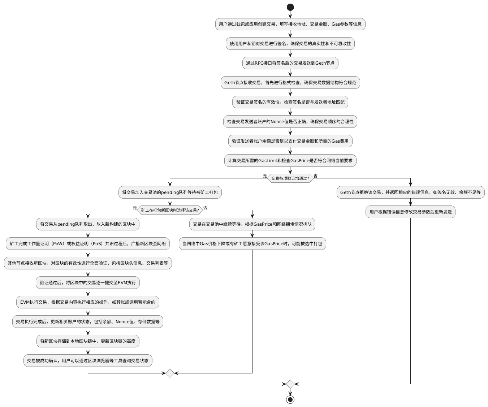

# Go-Ethereum 核心功能与架构设计研究
深入理解以太坊参考实现 Go-Ethereum（Geth）的设计哲学，掌握区块链核心组件的实现原理

## 一、Geth在以太坊生态中的定位
Go-Ethereum（Geth） 是以太坊协议的官方参考实现，由以太坊基金会主导开发，采用 Go 语言编写。作为目前使用最广泛的以太坊客户端，Geth 不仅是网络去中心化的关键支撑，也是协议演进和开发者生态的核心基础设施。

### 1.主流客户端地位
- 占据主网和测试网节点的 60% 以上份额
- 被广泛用于私有链搭建、DApp 开发、钱包后端等场景
- 是其他客户端（如 Besu、Erigon）的重要兼容标准

### 2.协议推动者
- 率先实现重大升级：The Merge（PoS）、EIP-1559、Shanghai 升级
- 通过 `--override` 参数支持实验性功能
- 提供 `dev` 模式用于快速测试与调试

### 3.多角色支持
| 角色 | 功能 |
|------|------|
| 全节点 | 同步完整区块链数据 |
| 轻节点（LES） | 仅下载区块头，按需查询状态 |
| 验证者节点（PoS） | 连接共识层客户端，参与出块 |
| 钱包服务 | 管理密钥、签名交易、发送请求 |

---

## 二、核心模块交互关系

### 1.区块链同步协议（eth/62, eth/63）
Geth 使用 `eth` 协议进行节点间通信，当前主流版本为 eth/63，兼容 eth/62。这两个协议版本是以太坊节点实现数据同步的核心规范，直接影响区块链数据传播效率和网络一致性。

| 协议版本 | 核心改进 | 数据传输方式 | 适用场景 |
|--------|----------|------------|---------|
| eth/62 | 区块头与区块体分离传输<br>基础状态同步支持 | 区块头批量请求+区块体按需下载 | 全节点初始同步 |
| eth/63 | 新增交易收据批量同步<br>状态证明优化<br>请求优先级控制 | 区块头+区块体+收据并行传输<br>递归默克尔证明验证 | 轻节点状态查询<br>全节点增量同步 |

#### 同步核心流程
1. **节点发现与握手：** 通过 Kademlia 协议发现节点，完成 `eth` 协议版本协商
2. **区块头同步：** 调用 `GetBlockHeaders` 批量获取区块头，验证链式结构完整性
3. **区块体同步：** 通过 `GetBlockBodies` 请求缺失区块的交易列表
4. **收据同步（eth/63）：** 使用 `GetReceipts` 获取交易执行结果，验证状态变更
5. **状态同步：** 通过默克尔证明验证账户状态，全节点存储完整状态，轻节点仅缓存查询结果
6. **数据校验：** 验证区块签名、交易合法性后写入数据库

### 2.交易池管理与 Gas 机制

#### 交易池（TxPool）核心架构
Geth 交易池采用双层队列结构实现高效交易管理：
- **Pending 队列**：存储可立即执行的交易（Nonce 连续且余额充足）
- **Queued 队列**：存储暂不可执行交易（Nonce 不连续或余额不足）

#### 核心功能：
1. **交易验证**：
    - 格式校验（RLP 编码、签名合法性）
    - 状态校验（Nonce 连续性、余额 ≥ 交易金额+Gas 费用）
    - 语义校验（GasLimit 合理性、禁止重复交易）
2. **优先级排序**：
    -  primary key：`GasPrice`（高 Gas 费优先）
    -  secondary key：`Timestamp`（同 Gas 费下旧交易优先）
3. **状态维护**：
    - 定期清理过期交易（超过 3 个区块未打包）
    - 区块打包后更新 Nonce 状态，将 Queued 中可执行交易迁移至 Pending
    - 支持通过 `txpool` 命令行接口查询/删除交易
    - 
#### Gas 机制核心参数：
| 参数 | 作用 | 决策主体 |
|------|------|---------|
| `GasLimit` | 单个交易最大计算步数 | 交易发送者 |
| `GasPrice` | 每步计算的价格（Wei） | 交易发送者（PoW）/ 系统建议（PoS） |
| `BaseFee` | 网络基础手续费（EIP-1559） | 协议自动调整 |
| `MaxFeePerGas` | 最大支付总费用（EIP-1559） | 交易发送者 |

#### Gas 费用计算：
- **PoW 阶段**：`总费用 = GasUsed × GasPrice`
- **PoS 阶段（EIP-1559）**：`总费用 = GasUsed × (BaseFee + Tip)`  
  （Tip 为给验证者的激励，BaseFee 销毁或燃烧）

### 3.EVM执行环境构建
Geth 通过 `core/vm` 包实现完整 EVM 执行环境，核心组件包括：

#### 执行环境初始化：
1. **状态数据库绑定**：关联 `StateDB` 实现账户状态读写
2. **Gas 管理器创建**：初始化 Gas 计数器，设置 `GasLimit` 上限
3. **上下文设置**：传入 `blockContext`（区块高度、时间戳等）和 `txContext`（发送者、GasPrice 等）
4. **预编译合约注册**：加载系统级预编译合约（如 `ecrecover`、`sha256`）

#### 执行核心流程：
1. **指令解析**：从合约字节码中读取 OPCODE，解析操作数
2. **栈式执行**：基于栈式虚拟机执行指令（算术运算、内存操作、存储访问）
3. **状态变更**：通过 `StateDB` 临时记录账户余额、存储数据变更
4. **Gas 消耗**：每步操作消耗固定 Gas，Gas 不足时触发 `OutOfGas` 异常
5. **结果提交**：执行成功则提交状态变更，失败则回滚所有操作

#### 关键特性：
- 确定性执行（相同输入必产相同输出）
- 沙箱隔离（限制对外部系统调用）
- 可调试性（支持 opcode 级日志输出）

### 4.共识算法实现（Ethash/POS）

#### Ethash（PoW）实现：
1. **核心原理**：通过内存密集型哈希运算实现工作量证明，抵抗 ASIC 矿机
2. **算法流程**：
    - 生成 DAG（有向无环图）数据集（每 30000 区块更新一次）
    - 计算区块头哈希与随机数（Nonce）的组合哈希
    - 验证哈希值是否低于目标难度（`hash < target`）
3. **Geth 实现**：
    - `miner` 包负责挖矿逻辑调度
    - `consensus/ethash` 实现哈希验证算法
    - 支持 CPU 挖矿（仅用于测试，实际依赖 GPU 矿机）

#### PoS（权益证明）实现：
The Merge 后，Geth 作为执行层客户端与共识层客户端（如 Prysm、Lighthouse）协同工作：
1. **角色定位**：
    - 执行层：负责交易执行、状态更新、生成执行结果
    - 共识层：负责区块提议、验证、共识投票
2. **交互流程**：
    - 共识层发送 `PayloadAttributes` 给执行层
    - 执行层生成 `ExecutionPayload`（包含交易列表和状态根）
    - 共识层完成共识后，执行层提交 payload 并更新状态
3. **安全机制**：
    - 签名验证：对共识层消息进行 BLS 签名验证
    - 分叉检测：通过 `Finalized` 区块标记防止分叉
    - slash 保护：拒绝双重签名等恶意行为

---

## 三、架构设计

### 1.分层架构图


### 2.各层关键模块说明

- **P2P网络层**：负责节点发现、连接和消息传递，实现以太坊节点的去中心化网络。
- **区块链协议层**：实现 eth/62、eth/63、les（轻节点协议）等，负责区块、交易、状态等数据的同步与广播。
   - `les`：轻节点协议，支持仅同步区块头和按需查询状态，适合资源受限设备。
   - `core/types`：定义区块、交易、收据等核心数据结构，是协议层与存储、执行层的桥梁。
- **状态存储层**：采用 LevelDB 存储区块、状态、交易等数据，核心为 `trie`（默克尔树实现），保障状态可验证性和高效性。
   - `trie`：默克尔-帕特里夏树，实现账户、存储等状态的高效存储与校验。
- **EVM执行层**：内置 EVM，负责智能合约和交易的字节码执行，确保以太坊的可编程性和安全性。

---

## 四、交易流程图



## 五、账户状态存储模型


如图所示，以太坊使用 **Merkle Patricia Trie（MPT，默克尔帕特里夏树）** 作为核心数据结构来组织和维护全球状态。该结构结合了 Merkle Tree 的可验证性与 Patricia Trie 的高效查找特性，确保了状态的一致性、安全性和轻节点可验证能力。

### 5.1 状态树（State Trie）

- **根哈希（stateRoot）**：每个区块头中包含一个 `stateRoot` 字段，指向当前区块生成后的全局状态根哈希。
- **键（Key）**：账户地址的 Keccak-256 哈希值（即 `keccak(address)`）。
- **值（Value）**：序列化的账户状态对象，包含以下字段：

```go
// core/types/account.go
struct StateAccount {
    uint64  Nonce;      // 外部账户：交易计数器；合约账户：创建合约数量
    *big.Int Balance;   // 账户余额（单位：wei）
    bytes32 Root;       // 存储树根哈希（storageRoot），空合约为空哈希
    bytes32 CodeHash;   // 合约代码哈希，EOA 为 keccak(empty)
}